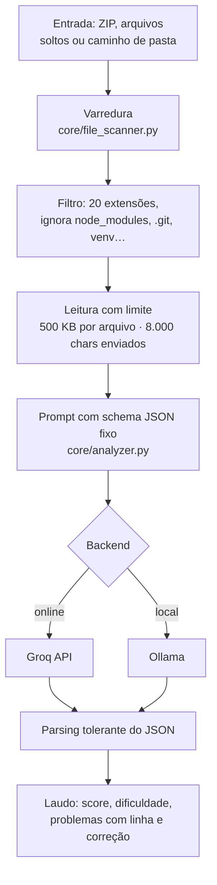

# QABot — análise de qualidade de código com LLM

Ferramenta que revisa código-fonte com um modelo de linguagem e devolve um
laudo estruturado: problemas localizados por linha, correção sugerida para
cada um, score de qualidade e classificação de dificuldade.

## Problema

Ferramenta de análise estática tradicional (linter, SAST) é determinística e
rápida, mas responde sempre a mesma coisa: aponta a regra violada. Ela não
explica por que aquilo é um problema, não propõe o trecho corrigido e não
avalia o código como um todo.

Revisão humana faz isso, mas não escala para um projeto inteiro nem está
disponível para quem está aprendendo.

O QABot ocupa esse meio: usa um LLM para revisar arquivo por arquivo e
devolver, além do apontamento, o trecho original, a versão corrigida e a
explicação do que mudou — em formato estruturado, não em texto solto.

## Como funciona



### O ponto central: saída estruturada, não texto

O prompt de análise ([core/analyzer.py](core/analyzer.py)) obriga o modelo a
responder **exclusivamente em JSON**, num schema fixo:

```json
{
  "resumo": "diagnóstico em 2-3 frases",
  "score_qualidade": 0,
  "classificacao_dificuldade": "Fácil | Médio | Difícil",
  "problemas": [{
    "tipo": "erro | aviso | segurança | performance | estilo",
    "severidade": "crítico | alto | médio | baixo",
    "linha_inicio": 0,
    "trecho_original": "o código exato com o erro",
    "correcao_sugerida": "a versão corrigida",
    "explicacao_correcao": "o que mudou e por quê"
  }],
  "pontos_positivos": [],
  "recomendacoes_gerais": []
}
```

Isso é o que permite renderizar o resultado como interface — ordenar por
severidade, mostrar o diff lado a lado, filtrar por tipo — em vez de despejar
um parágrafo na tela.

Como modelo nem sempre respeita a instrução, `parse_analysis_response()` tenta
três estratégias antes de desistir: parse direto, extração de bloco
` ```json `, e recorte entre a primeira `{` e a última `}`.

### Critérios fixados no prompt

Para que score e dificuldade não variem ao acaso, as faixas estão escritas
como regra:

| Natureza do problema | Score | Dificuldade |
|---|---|---|
| Estilo e boas práticas (import não usado, print de debug) | 70–90 | Fácil |
| Lógica, exceção não tratada, credencial hardcoded | 40–69 | Médio |
| SQL Injection, `eval`/`os.system` com entrada externa, senha em log | 0–39 | Difícil |

### Varredura

[core/file_scanner.py](core/file_scanner.py) aceita 20 extensões (Python,
JavaScript/TypeScript, Java, C#, C/C++, Go, Ruby, PHP, HTML, CSS, SQL, shell,
JSON, YAML, Markdown) e ignora `__pycache__`, `.git`, `node_modules`, `.venv`,
`dist`, `build`, `.idea`, `.vscode` e caches de teste.

Arquivos acima de 500 KB ficam de fora. Os demais são truncados em 8.000
caracteres antes de ir para o modelo, com marcação explícita de corte.

### Dois backends

| Backend | Onde roda | Modelos |
|---|---|---|
| **Groq** | API online | `llama-3.3-70b-versatile`, `llama3-70b-8192`, `mixtral-8x7b-32768`, `llama3-8b-8192` |
| **Ollama** | Máquina local | qualquer modelo baixado, padrão `llama3` |

[core/ai_client.py](core/ai_client.py) expõe os dois atrás da mesma função
`call_ai()`, então o resto do código não sabe qual está em uso. Para o Ollama
há um teste de conexão que lista os modelos disponíveis antes de analisar.

Temperatura fixa em 0.2 nos dois — análise de código não deve variar entre
execuções mais do que o necessário.

### Três modos de uso

- **Analisar Projeto** — sobe um ZIP, seleciona arquivos soltos ou aponta um
  caminho de pasta local; varre e analisa em lote
- **Analisar Código** — cola um trecho direto e recebe o laudo
- **Chat QA** — conversa sobre testes, CI/CD, refatoração e boas práticas,
  sem contexto de arquivo

## Stack

| Camada | Escolha |
|---|---|
| Interface | Streamlit |
| LLM online | `groq` |
| LLM local | Ollama via HTTP (`requests`) |

Três dependências diretas, nenhuma pesada. Não usa framework de orquestração
de LLM: as chamadas são diretas, e o schema JSON é validado no próprio código.

## Estrutura de pastas

```
qabot/
├── app.py                  # ponto de entrada e layout das abas
├── core/
│   ├── ai_client.py        # Groq e Ollama atrás da mesma interface
│   ├── analyzer.py         # prompts, schema JSON e parsing das respostas
│   └── file_scanner.py     # varredura, filtros e leitura dos arquivos
├── ui/
│   ├── sidebar.py          # escolha de backend, modelo e chave
│   ├── tab_project.py      # análise em lote (ZIP, arquivos ou pasta)
│   ├── tab_code.py         # análise de um trecho colado
│   └── tab_chat.py         # chat sobre QA
├── utils/
│   └── helpers.py          # renderização do laudo
└── requirements.txt
```

## Como rodar

### 1. Clonar e instalar

```bash
git clone https://github.com/brunodt98/qabot.git
cd qabot
python -m venv .venv
source .venv/bin/activate        # Windows: .venv\Scripts\Activate.ps1
pip install -r requirements.txt
```

### 2. Executar

```bash
streamlit run app.py
```

### 3. Escolher o backend na barra lateral

**Groq** — crie uma conta em [console.groq.com](https://console.groq.com),
gere uma API Key e cole na barra lateral.

**Ollama** — instale o [Ollama](https://ollama.com), baixe um modelo com
`ollama pull llama3` e selecione Ollama na barra lateral. Nesse modo nenhum
código sai da sua máquina, o que importa ao analisar projeto privado.

## Limitações e próximos passos

- **É revisão por LLM, não análise estática determinística.** O QABot não
  executa o código, não roda testes e não percorre a árvore sintática. Ele
  complementa linter e SAST, não substitui.
- **Score e dificuldade são julgamento do modelo**, não métrica calculada. As
  faixas do prompt reduzem a variação, mas duas execuções sobre o mesmo
  arquivo podem divergir. Não sirva esse número como indicador auditável.
- **Cada arquivo é analisado isoladamente.** O modelo não enxerga relação
  entre módulos, então não detecta problema que só aparece na integração.
- **Arquivos são truncados em 8.000 caracteres.** Em arquivo longo, a análise
  cobre só o começo — e o problema pode estar depois do corte.
- **Nenhuma validação de schema além do parsing.** Se o modelo devolver JSON
  válido mas com campo faltando, o erro aparece só na renderização. Um
  contrato explícito (Pydantic, por exemplo) resolveria.
- **Sem testes automatizados** e sem conjunto de avaliação. Não há medida de
  quantos problemas reais ele encontra nem de quantos falsos positivos gera —
  seria o próximo passo natural: montar arquivos com defeitos conhecidos e
  medir acerto.

## Contexto

Projeto Integrador — Ciência de Dados, Fatec Cotia.
Empresa parceira: Outtech Services IT.

## Autor

**Bruno Silva** — Ciência de Dados, Fatec Cotia
[linkedin.com/in/brunosilva09](https://linkedin.com/in/brunosilva09)
